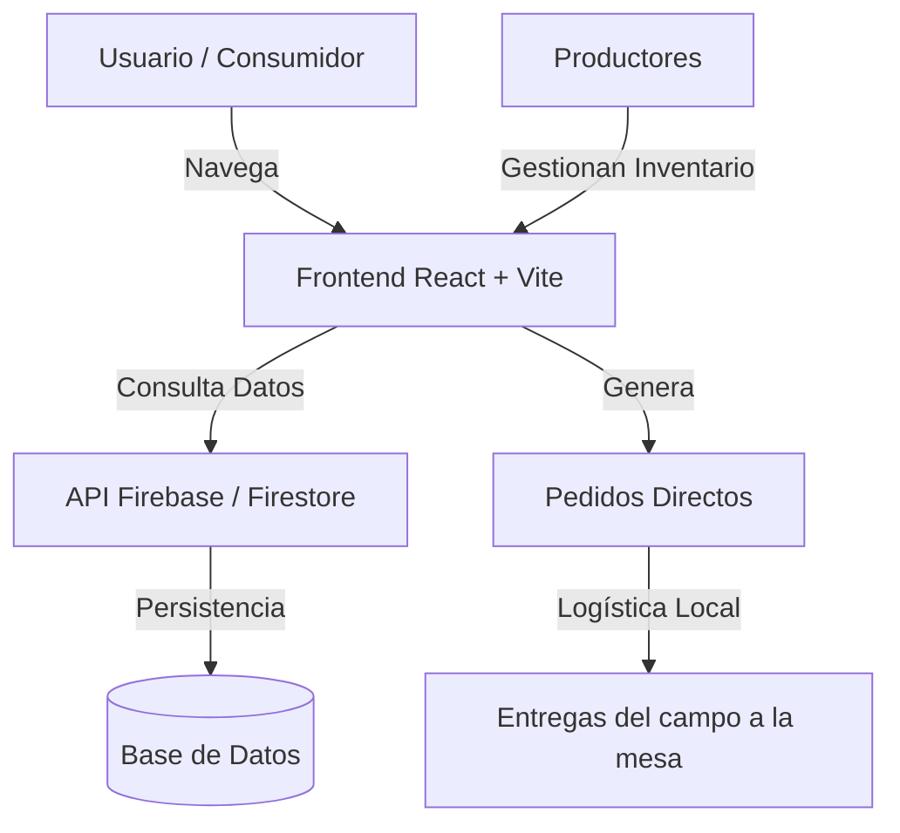

  

<h2 align="center">Del campo a tu mesa</h2>

  

---

## 🚀 Demo
Explora la plataforma en vivo aquí: [https://delhuerto.vercel.app/](https://delhuerto.vercel.app/)

## 🌿 Sobre el Proyecto
**DelHuerto** es una plataforma web diseñada para cerrar la brecha entre los **pequeños productores agrícolas** y los **consumidores conscientes**. En un mundo dominado por largas cadenas de suministro, DelHuerto devuelve el poder a lo local, permitiendo que alimentos frescos y sostenibles lleguen directamente desde la tierra a tu hogar, sin intermediarios innecesarios.

Nuestro propósito es:
- **Fortalecer el comercio local** y la economía campesina.
- **Garantizar soberanía alimentaria** mediante el acceso directo a productos de temporada.
- **Reducir la huella de carbono** al minimizar los traslados logísticos.

## 🛠️ Cómo Funciona
Transformar tu alimentación y apoyar al campo es tan simple como 1, 2, 3:

| Paso | Acción | Descripción |
| :--- | :--- | :--- |
| **01** | 🔍 **Explora** | Descubre productos frescos cultivados cerca de ti por manos locales. |
| **02** | 🛒 **Pide** | Añade lo que necesites a tu carrito y confirma tu pedido directamente. |
| **03** | 📦 **Recibe** | Coordina la entrega y paga directamente al productor al recibir tus productos. |

## 📊 Impacto Real
Estamos comprometidos con los Objetivos de Desarrollo Sostenible (ODS).

| Métrica | Logro |
| :--- | :--- |
| 👨‍🌾 **Productores Locales** | +120 |
| 🥦 **Alimentos Frescos** | +3K |
| 👨‍👩‍👧‍👦 **Familias Felices** | +500 |
| 🌍 **Reducción de Emisiones** | 30% |

## 💻 Tecnologías Utilizadas
Construido con un stack moderno para máxima velocidad y escalabilidad.

| Tecnología | Uso |
| :--- | :--- |
| **React 19** | Biblioteca principal para la interfaz de usuario. |
| **Vite** | Herramienta de construcción y servidor de desarrollo ultra rápido. |
| **Node.js** | Entorno de ejecución para el servidor y herramientas. |
| **Tailwind CSS** | Framework de estilos para un diseño artesanal y responsive. |
| **Firebase** | Backend as a Service para autenticación y base de datos. |
| **Vercel** | Hosting y despliegue continuo (CI/CD). |

## 🏗️ Arquitectura del Sistema

## 📸 Preview Visual

  

## 🗺️ Roadmap
- [ ] **Autenticación Avanzada**: Perfiles detallados para cada finca.
- [ ] **Marketplace Completo**: Filtros por categorías, fincas y cercanía.
- [ ] **Pagos Digitales**: Integración con pasarelas de pago locales.
- [ ] **App Móvil**: Versión nativa para productores en el campo.
- [ ] **Panel de Administración**: Analíticas de ventas e impacto para el productor.

## 📧 Contacto
- **Email**: [hola@delhuerto.com](mailto:hola@delhuerto.com)
- **Ubicación**: Cali, Colombia 🇨🇴

---

Hecho por DelHuerto

